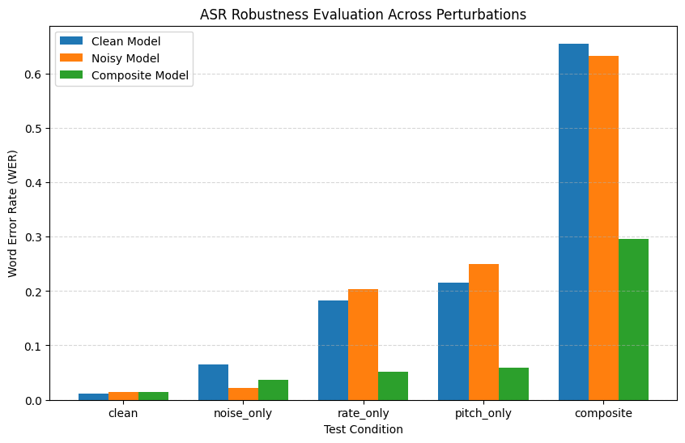

# Noise-Robust Speech Recognition using Wav2Vec2

This project investigates the robustness of Automatic Speech Recognition (ASR) systems when exposed to real-world audio perturbations. Using the Wav2Vec2 architecture, multiple models are trained with different augmentation strategies and evaluated under controlled distortions such as noise, speech rate variation, pitch shifts, and composite perturbations.

The goal is to analyze how different training strategies influence ASR robustness when the test data distribution deviates from clean speech.

---

## Project Objectives

- Analyze the LibriSpeech dataset and understand speech characteristics.
- Implement controlled audio perturbations including noise, rate shift, and pitch shift.
- Train multiple ASR models using different augmentation strategies.
- Evaluate model robustness under several controlled conditions.
- Compare performance using Word Error Rate (WER).

---

## Dataset Details

### Clean Speech Dataset

- **Dataset:** LibriSpeech (train-clean-100)
- **Total Samples:** 28,539
- **Total Duration:** 100.6 hours
- **Unique Speakers:** 251
- **Sampling Rate:** 16 kHz

### Noise Dataset

- **Dataset:** MUSAN Noise Corpus
- **Noise Files:** 930

Noise is dynamically added during training and evaluation using controlled Signal-to-Noise Ratio (SNR) levels.

---

## Audio Perturbations

Several perturbations are used to simulate realistic speech conditions.

### Noise

Noise is injected using Signal-to-Noise Ratio (SNR):

SNR(dB) = 10 log10 (P_signal / P_noise)

Noise levels are sampled between 0–20 dB.

### Rate Shift

Speech speed is modified using time-stretching:

- 0.8x (slow speech)
- 1.0x (normal speech)
- 1.2x (fast speech)

### Pitch Shift

Pitch is modified using semitone shifts:

- −2 semitones
- 0
- +2 semitones

### Composite Perturbation

A combination of multiple distortions:

- noise
- rate shift
- pitch shift

This setup approximates real-world noisy and distorted audio conditions.

---

## Model Architecture

Base model:

facebook/wav2vec2-base-960h

Framework:

- PyTorch
- HuggingFace Transformers

Model type:

Wav2Vec2ForCTC

Training and evaluation are implemented using the HuggingFace Trainer API.

---

## Training Strategy

Three models are trained with different augmentation strategies.

### Clean Model

Trained only on clean speech without augmentation.

### Noisy Model

Trained with dynamic noise injection during training.

### Composite Model

Trained using multiple perturbations simultaneously:

- noise
- rate shift
- pitch shift

This model aims to improve general robustness across multiple distortions.

---

## Evaluation Setup

Models are evaluated under five different conditions.

| Condition | Noise | Rate | Pitch |
|-----------|------|------|------|
| Clean | No | 1.0 | 0 |
| Noise Only | Yes | 1.0 | 0 |
| Rate Only | No | 0.8 | 0 |
| Pitch Only | No | 1.0 | +2 |
| Composite | Yes | 0.8 | +2 |

Each trained model is evaluated under every condition.

---

## Evaluation Metric

Primary evaluation metric:

**Word Error Rate (WER)**

WER = (Substitutions + Insertions + Deletions) / Total Words

Lower WER indicates better transcription accuracy.

Character Error Rate (CER) is also computed.

---

## Experimental Results

| Condition | Clean Model | Noisy Model | Composite Model |
|-----------|-------------|-------------|----------------|
| Clean | 0.0119 | 0.0146 | 0.0148 |
| Noise Only | 0.0649 | 0.0219 | 0.0366 |
| Rate Only | 0.1819 | 0.2033 | 0.0520 |
| Pitch Only | 0.2159 | 0.2489 | 0.0583 |
| Composite | 0.6553 | 0.6328 | 0.2953 |

These results demonstrate the effect of different training strategies on robustness.

---

## Key Findings

- The clean model performs best on clean speech but degrades significantly under perturbations.
- The noisy model performs well under noisy conditions but remains sensitive to speech rate and pitch variations.
- The composite model achieves the best overall robustness across multiple perturbation types.
- Multi-condition training substantially reduces performance degradation under distribution shifts.

---

## Visualization

Robustness comparisons are visualized using grouped bar charts showing Word Error Rate across conditions.

---

## Technologies Used

- Python
- PyTorch
- HuggingFace Transformers
- Librosa
- NumPy
- Pandas
- HuggingFace Datasets
- Evaluate (WER, CER)
- Matplotlib

---

## Conclusion

This project demonstrates that training ASR systems with controlled perturbations significantly improves robustness under real-world conditions. Models trained with composite augmentations show the best performance when speech contains multiple distortions simultaneously.

Robust training strategies are therefore essential for deploying speech recognition systems in practical environments where audio conditions vary significantly.

---

## Author

**Madeshwaran E**  
Machine Learning / Speech Recognition  
GitHub: https://github.com/madesh405